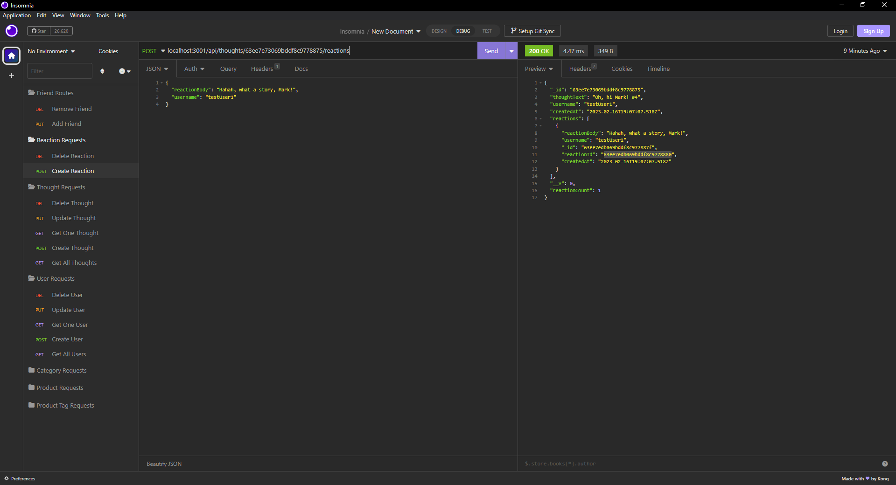

# social-network-api

A simple API using mongoDB and mongoose. The API allows for creation of users, thoughts, and reactions to thoughts.
When a user gets deleted, their corresponding thoughts get deleted as well. When a reaction is deleted, they are removed from their corresponding thought. Username's, emails, and thoughts can all be updated as well. Below are are screenshots of some API responses as well as a walkthrough video.
 
 
 
 
 

 
 

[Walkthrough Video](https://drive.google.com/file/d/1gWDOlF3eVy8DUQKW-5_N6f9owj_5bpDD/view)